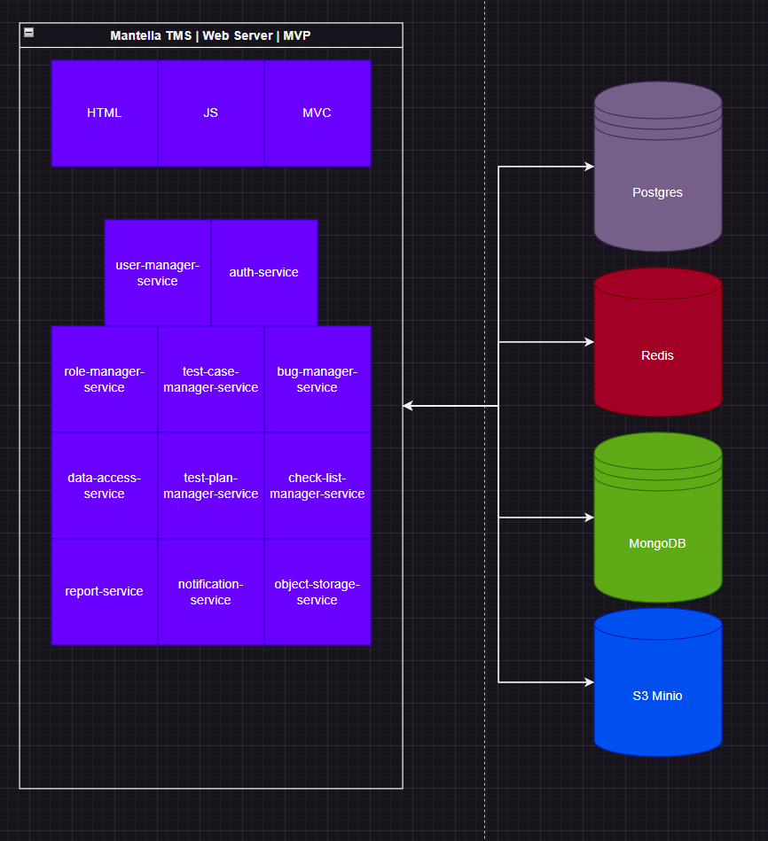

# Mantella TMS

a test management system.
Mantella-TMS (Test Management System) - это программа для эффективного управления тестированием и
контроля качества продукта. Это программное обеспечение имеет модульную архитектуру,
которая обеспечивает широкий функционал для удобного и гибкого управления тестовыми заданиями в различных проектах.

Основной функционал программы включает в себя возможность планирования тестирования, определения приоритетов,
сроков выполнения и назначения ответственных сотрудников.
С Mantella-TMS легко создавать тестовые сценарии, тест-кейсы, чек-листы и другие тестовые артефакты для организации
процесса тестирования.
Важной составляющей программы является возможность вести отчетность о результатах тестирования, отслеживать ошибки,
предпринятые действия и их результаты.

Архитектура Mantella-TMS представляет из себя несколько ключевых модулей.

